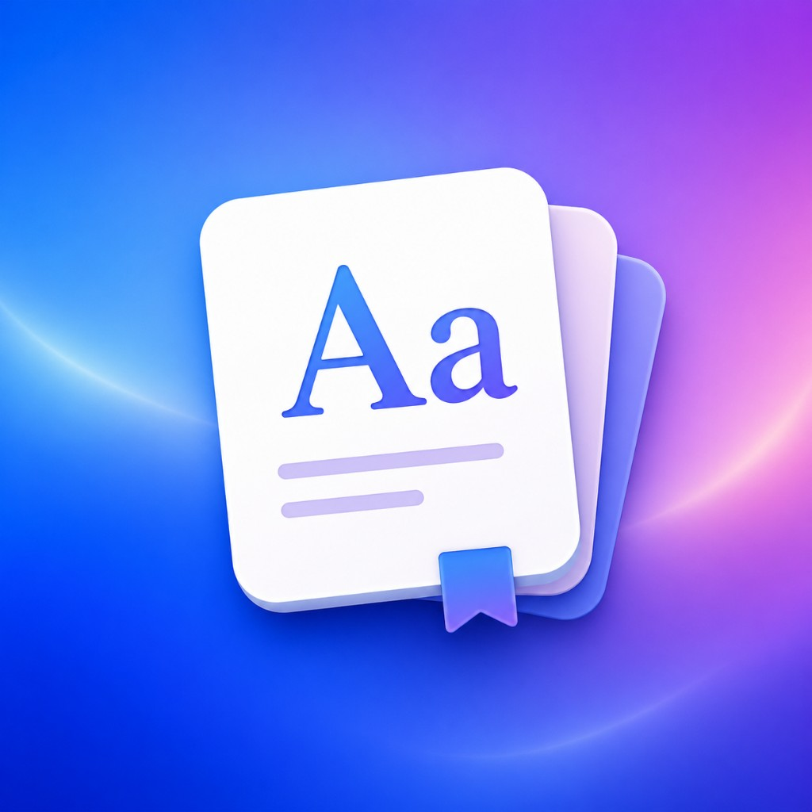

# 单词本（Wordbook）

macOS 生词本应用 —— 自动收录、间隔重复复习、多源翻译增强。

<p align="center">
  
</p>

## 功能

### 🔴 核心

- **自动收录** — 后台轮询剪切板，智能识别中英文并过滤噪音（URL、代码、序列号等 30+ 条规则）
- **间隔重复** — SM-2 算法（含 Easiness Factor 动态调整），支持 [1, 3, 7, 14, 30] 天间隔递增
- **多源翻译** — Lingva + LibreTranslate + MyMemory 并行翻译，详情页显示来源与置信度
- **词典增强** — FreeDictionary API 查词 + 自动翻译中文释义，支持缓存
- **长句拆分** — 复制长句自动拆分为 6 词+ 片段，停用词丢弃，词形还原，原句保留为公共例句
- **模糊搜索** — Levenshtein 编辑距离容错搜索
- **10 级熟悉度色阶** — 侧边栏圆点按 reviewCount 颜色渐变

### 🟡 复习与学习

- **多种复习模式** — 正向（看英文想中文）、反向（看中文想英文）、拼写模式、挖空填空（Cloze Deletion）
- **macOS TTS 发音** — 详情页/复习页一键朗读单词和例句
- **复习批次自动补充** — 做完一批自动加载下一批
- **每日目标圆环** — 侧边栏复习进度可视化
- **定时提醒** — 本地通知每天定时提醒复习
- **键盘快捷键** — Space 翻答案、1/2/3/4 评分、上下箭头切换词条、Cmd+Z 撤销

### 🟢 增强功能

- **Swift Charts 统计** — 7 天学习柱状图 + 掌握率分布图
- **Anki TSV 导出** — 兼容 Anki 间隔重复系统
- **菜单栏小组件** — MenuBarExtra 到期数 + 快捷操作
- **拖拽添加** — 任意 App 拖选文本到窗口即添加
- **批量操作** — 选择模式，批量标记掌握/删除
- **标签自动补全** — 输入标签时提示已有标签
- **例句关联展示** — 同例句单词互相可见
- **开机自启动** — SMAppService LoginItem
- **历史快照** — 每日自动快照，保留 30 天，可回退
- **撤销 Cmd+Z** — undo 栈 20 步

## 系统要求

- macOS 13+
- Swift 5.9+

## 安装

### 从源码构建

```bash
git clone https://github.com/yaoniesusu/Wordbook.git
cd Wordbook
swift build
swift run
```

### 打包为 .app

```bash
bash Scripts/package-to-desktop.sh
```

## 测试

```bash
swift test
```

当前 88 个测试全部通过。

## 架构

```
Sources/Wordbook/
├── WordbookApp.swift              # @main 入口，注册默认值，环境注入
├── Models/
│   ├── VocabularyEntry.swift      # 核心数据模型（中英对照、例句、标签、SM-2 状态）
│   ├── DictionaryEntryCache.swift # 词典缓存
│   ├── IngestHistoryItem.swift    # 收录历史
│   └── WordbookStats.swift        # 统计数据
├── Services/
│   ├── WordbookStore.swift        # @MainActor 中央状态管理（CRUD、复习、索引、持久化）
│   ├── PersistenceController.swift# JSON 持久化 + 自动备份
│   ├── ReviewEngine.swift         # SM-2 间隔重复算法
│   ├── FuzzySearchEngine.swift    # Levenshtein 模糊搜索
│   ├── ClipboardParser.swift      # 剪切板解析 + 噪音过滤
│   ├── TranslationService.swift   # 多源翻译（Lingva/LibreTranslate/MyMemory）
│   ├── DictionaryLookupService.swift # FreeDictionary API 查词
│   ├── SentenceSplitter.swift     # 长句拆分 + 词形还原
│   ├── SpeechService.swift        # macOS TTS 朗读
│   ├── ReviewReminderService.swift# 本地通知提醒
│   ├── PasteboardReading.swift    # 剪切板读取协议
│   ├── StorageLocationResolver.swift # 数据目录解析
│   └── PlatformFeatures.swift     # 平台特性
└── Views/
    ├── ContentView.swift          # 主界面（NavigationSplitView + 工具栏）
    ├── EntryListView.swift        # 侧边栏词条列表
    ├── EntryDetailView.swift      # 词条详情编辑
    ├── DailyReviewView.swift      # 间隔重复复习窗口
    ├── StatsView.swift            # 学习统计图表
    ├── ManualEntrySheet.swift     # 手动新增
    ├── AppSettingsScene.swift     # 设置（Cmd+,）
    ├── SurfaceStyles.swift        # 通用 UI 样式
    └── UnavailablePlaceholderView.swift
```

## 核心设计

- **状态管理** — `WordbookStore` 是唯一真相源，通过 `@EnvironmentObject` 注入视图树
- **持久化** — JSON 文件存储于 `~/Library/Application Support/Wordbook/`，含自动备份
- **索引** — `entriesByID`、`entryIDsByNormalizedEnglish`、`searchIndex` 三个字典加速查询
- **剪切板** — 1.15s 轮询 `NSPasteboard.changeCount`，经 `ClipboardParser.shouldAutoIngest` 多层过滤
- **复习算法** — SM-2 实现，Easiness Factor 动态调整间隔，reviewCount ≥ 5 标为已掌握
- **翻译** — 手动添加时若缺中文则调多源翻译 API 自动补齐，超时 8s

## 技术栈

- Swift 5.9 + SwiftUI
- Swift Package Manager
- AppKit (NSWindow, NSPasteboard, NSSpeechSynthesizer)
- Swift Charts
- UserDefaults + JSON 文件持久化

## 编码约定

- UI 文本使用中文
- 新功能优先在现有服务/视图中扩展，避免新建文件
- 翻译/词典等网络请求需设超时
- UserDefaults key 用 camelCase，注册默认值在 `WordbookApp.init()`

## License

MIT
